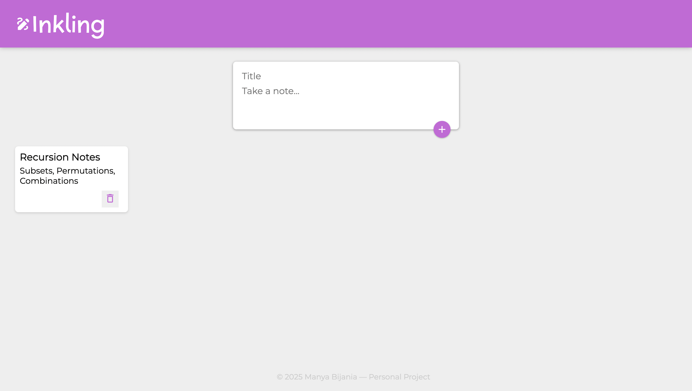

# INKLING - Notes App

**Inkling** is a sleek and minimalist notes app built with **React**. Designed for simplicity and ease of use, it allows users to quickly jot down thoughts, and manage their ideas.
---

**Check out the live app here:**  [Preview Link](https://p8f5zp.csb.app)

---

## Features

-  **Add Notes**  
  Create new notes with a single click.

-  **Delete Notes**  
  Remove unwanted notes instantly.

-  **Responsive UI**  
  Clean, user-friendly interface that works across devices.

---

## Tech Stack

- **React** – Front-end UI
- **JavaScript (ES6+)**
- **HTML5 & CSS3**
  
---
## Screenshots

Here’s a quick look of the UI:

###  Notes Dashboard

